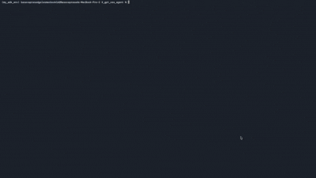

# Browser Automation Agents

A collection of browser automation agents powered by local LLMs via Ollama. All agents share a common "brain loop" architecture but differ in how they perceive and interact with web pages.

## Demo



https://x.com/gola_basava/status/2005356794915545582

## Architecture

```
┌─────────────────────────────────────────────────────────┐
│                   Brain Loop (all agents)               │
├─────────────────────────────────────────────────────────┤
│                                                         │
│   ┌─────────┐    ┌─────────┐    ┌─────────┐            │
│   │  EYES   │───▶│  BRAIN  │───▶│  HANDS  │            │
│   │ (state) │    │  (LLM)  │    │(actions)│            │
│   └─────────┘    └─────────┘    └─────────┘            │
│        ▲                              │                 │
│        └──────────────────────────────┘                 │
│                   (repeat)                              │
│                                                         │
└─────────────────────────────────────────────────────────┘
```

Each loop iteration:
1. **Eyes** capture current state (DOM or screenshot)
2. **Brain** (LLM) decides next action based on goal + history + state
3. **Hands** execute the action
4. Result stored in action history, loop repeats

## Agents

### DOM-Based Agents

These agents parse the DOM to extract interactive elements with indices.

| File | Model | Use Case |
|------|-------|----------|
| `gpt_oss_20b.py` | gpt-oss:20b | General browser automation |
| `Linkedin_gpt_oss_agent/` | gpt-oss:120b | LinkedIn job applications |

**How it works:**
- `get_page_state()` extracts all interactive elements as indexed list
- Model receives: `[0] BUTTON: Submit`, `[1] INPUT[text]: Search`, etc.
- Model outputs tool calls like `click(0)` or `type_text(1, "hello")`

**Pros:** Fast, precise element targeting, works with complex forms
**Cons:** Can miss dynamically loaded content, requires DOM parsing logic

### Vision-Based Agents

These agents use screenshots and coordinate-based clicking.

| File | Model | Use Case |
|------|-------|----------|
| `qwen3_vl_30b.py` | qwen3-vl:30b | Multi-image context, bounding box clicks |
| `gemma3_27b.py` | gemma3:27b | Simple coordinate clicking |

**How it works:**
- Takes screenshot, sends to vision model as base64
- Model returns coordinates: `{"x": [396, 476], "y": [200, 240]}`
- Agent clicks at center of bounding box

**Pros:** Works on any UI, no DOM parsing needed, sees what user sees
**Cons:** Slower, less precise, coordinate scaling issues

## Setup

```bash
# Install dependencies
pip install -r requirements.txt

# Run Ollama with your chosen model
ollama run gpt-oss:20b          # For DOM agents
ollama run qwen3-vl:30b         # For vision agent
ollama run gemma3:27b           # For simple vision agent
```

## Usage

### General Browser Automation
```bash
# Edit PROMPT in prompts_gpt_oss20b.py
python gpt_oss_20b.py
```

### LinkedIn Job Applications
```bash
# Edit SYSTEM_PROMPT in Linkedin_gpt_oss_agent/tools.py with your info
cd Linkedin_gpt_oss_agent
python brain.py
```

### Vision-Based Automation
```bash
# Edit prompt in the file
python qwen3_vl_30b.py   # With action history
python gemma3_27b.py     # Simple single-target
```

## Project Structure

```
.
├── gpt_oss_20b.py              # DOM agent with memory
├── prompts_gpt_oss20b.py       # System prompt & tools for DOM agent
├── tools.py                    # Shared browser tools (DOM-based)
├── config.py                   # Ollama API config
├── qwen3_vl_30b.py             # Vision agent with screenshot history
├── gemma3_27b.py               # Simple vision agent
├── Linkedin_gpt_oss_agent/     # LinkedIn-specific automation
│   ├── brain.py                # Main loop
│   ├── tools.py                # LinkedIn-optimized tools
│   └── developer_window.txt    # Runtime goal injection
└── requirements.txt
```

## Key Concepts

### Action History
All agents maintain a history of recent actions to provide context:
```python
signals_from_hand = []  # Last N actions
# Model sees: "1. Clicked [0] Search  2. Typed 'hello'  3. ..."
```

### Failure Recovery
DOM agents track consecutive failures and suggest alternatives:
```python
if "✗" in result:
    failure_count += 1
    # After 2 failures: "Try alternative approach or use task_failed"
```

### Automatic Retry
When `click()` fails, DOM agents fall back to `js_click()`:
```python
if organ == "click" and "✗" in turn_the_page:
    retry = await js_click(organ_signals["element_index"])
```

### Visual Feedback
Vision agents show click indicators on screen:
```python
show_click_indicator(x, y, "red")  # Red ring + dot animation
```

## Tool Categories

### DOM Agent Tools
| Category | Tools |
|----------|-------|
| Navigation | `scroll`, `go_back` |
| Interaction | `click`, `js_click`, `type_text`, `press_key`, `hover` |
| Perception | `get_page_state`, `find_elements_by_text` |
| Special | `upload_file_auto`, `handle_alert` |
| Completion | `task_complete`, `task_failed` |

### Vision Agent Tools
| Category | Tools |
|----------|-------|
| Interaction | `mouse_click(x, y)`, `type_text`, `press_key` |
| Navigation | `scroll` |

## Configuration

### Ollama API
```python
# config.py
OLLAMA_API_URL = "http://localhost:11434/api/chat"
MODEL_NAME = "gpt-oss:20b"
```

### Chrome Profile
All agents use a persistent Chrome profile for maintaining login sessions:
```python
profile_path = os.path.expanduser('~/AI Studio/chrome_automation_profile')
```

## Requirements

- Python 3.8+
- Ollama running locally
- Chrome/Chromium browser
- For vision agents: OpenCV (`pip install opencv-python`)

## Tips

1. **Start simple**: Use `gemma3_27b.py` to test vision approach on a single target
2. **DOM for forms**: Use DOM agents for complex forms with many inputs
3. **Vision for visual UI**: Use vision agents for apps with non-standard elements
4. **Check the profile**: Login to sites manually first in the Chrome profile
5. **LinkedIn**: Easy Apply forms work best; external applications may vary
